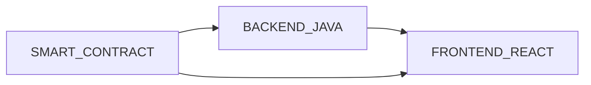
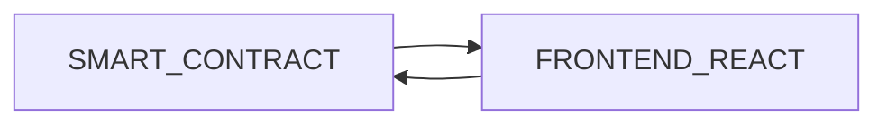

# ¿Por qué se necesita una cuenta para interactuar con la plataforma?

<!-- markdownlint-disable MD033 -->
<html></html>

## Contenido

- [¿Por qué se necesita una cuenta para interactuar con la plataforma?](#por-qué-se-necesita-una-cuenta-para-interactuar-con-la-plataforma)
  - [Contenido](#contenido)
  - [Introducción](#introducción)
    - [Uso de Wallets](#uso-de-wallets)
    - [Añadir Redes a la Wallet](#añadir-redes-a-la-wallet)
    - [¿Tendrán que pagar los usuarios por ver las promesas electorales?](#tendrán-que-pagar-los-usuarios-por-ver-las-promesas-electorales)
    - [Arquitecturas](#arquitecturas)
  - [Referencias](#referencias)
  - [FootNotes](#footnotes)

## Introducción

En este tipo de aplicaciones Web, o **Web3**, al utilizar Contratos Inteligentes y la tecnología BlockChain, se obliga en consecuencia a utilizar transacciones.
En anteriores apartados se ha comentado que todo inicio de un cambio de estado[^1] en un contrato debe ser iniciado por una transacción y su origen debe ser una EOA (Externally Owned Account), es decir, una cuenta externa, todo ello es para salvaguardar la integridad de la red Blockchain y permitir esa trazabilidad de los datos.
También he descrito las carteras, o Wallets, son las encargadas de almacenar el conjunto de direcciones (del tipo 0x0000...00) generadas a partir de la famosa Criptografía de Curva Elíptica y a continuación generando el par de claves asimétricas.

### Uso de Wallets

En la actualidad, y para el desarrollo de esta plataforma se ha utilizado Metamask para las pruebas, esta herramienta, es muy sencilla de instalar en el navegador web, como por ejemplo Chrome o Brave. ¿Pero y si quiero ver las promesas desde mi móvil? Pues también es muy sencillo ya que existen navegadores dedicados a la Web3, por ejemplo, el mismo Brave.

Lo único que se debe tener en cuenta es que una vez creada se apunte el conjunto de palabras, que forma parte de la contraseña en un lugar seguro y la contraseña abreviada.

### Añadir Redes a la Wallet

También se debe tener en cuenta que un dirección no vale para más de una red Blockchain, es decir, no vale una dirección 0x0001 para Ethereum que para Binance (otra red), sino se han agregado con anterioridad, por tanto debemos "registrarlas" en la red que queramos. Ante esta dificultad las propias páginas web añaden una forma sencilla de añadir las nuevas cuentas para la nueva red. Un ejemplo de ello sería la página de Binance donde sirven su token de la red de prueba (o testnet), Binance la explicaré más adelante, de momento se puede decir que es muy parecida a Ethereum. Si entramos [aquí](https://testnet.bscscan.com/) veremos abajo del todo un botón con el icono de metamask y el texto:

> Add BSC Network.

Esto permitirá que haya direcciones para la red de binance testnet. Esto mismo pasa en otras redes que utilizan la tecnología BlockChain. Además, la propia Metamask dispone para el usuario mediante los ajustes agregas más redes como Avalanche, Aurora, Fantom, etc...

### ¿Tendrán que pagar los usuarios por ver las promesas electorales?

No, solo necesitarán tener una dirección generada en la red en la cual se ha desplegado el contrato, ya que cualquier consulta de datos es gratuita para las direcciones de tipo EOA, las normales, por ello existe un método en el contrato Electoral Manager que permite retornar todo el conjunto de promesas de manera sencilla y gratuita, solo quedando que el front se encargue de mostrarlo de manera intuitiva para el usuario.

### Arquitecturas

Otra manera de ofrecer esta plataforma sería mediante una aplicación básica como la propia web de la Universidad de Oviedo o la de cualquier periódico, pero que ofreciera una pasarela donde un político pudiera registrar sus promesas o simplemente permitirlo desde la parte web que llame al Smart Contract, y por supuesto, dejando la consulta gratuita. De esta manera se podría tener un sistema[^2]:

La parte del backend, escrita por ejemplo en java, deberá de contar con una librería que permita la conexión como puede ser [web3j-core](https://mvnrepository.com/artifact/org.web3j/core), se trata de una librería que permite la conexión con contratos y nodos de la red de Ethereum para java (existen también para python, javaScript, ...). Este tipo de sistema no solo implicaría un mantenimiento del frontend como es la solución propuesta sino que además habría que dar soporte a cambios en el backend además de disponer y controlar una cuenta para que el propio backend haga las llamadas de consulta. Y sin contar con utilizar una base de datos.

Todo esto elevaría la complejidad del proyecto. lo haría más centralizado necesitando de un servidor web. Por tanto, sin un backend, retiramos una parte importante de la plataforma final, en el cual habría que invertir un tiempo en su desarrollo, proveerla de una cuenta en la red BlockChain elegida finalmente, probarlo y mantenerlo.

La plataforma, por tanto, contará con una estructura más minimalista:

## Referencias

- [Metamask web](https://metamask.io/)
- [Binance testnet](https://testnet.bscscan.com/)
- [Ejemplo conexión java a smart contract](https://medium.com/coinmonks/how-to-interact-with-smart-contract-using-java-f5b1ce7324e7)

## FootNotes

[^1]: Un cambio de estado en un contrato o una visión de los datos que almacena un contrato inteligente, no es nada más que poder por ejemplo consultar el número de promesas electorales que existen, es decir, ver o cambiar variables de un contrato.
[^2]: Asumir que las líneas del gráfico son bidireccionales, es decir, hay una conexión entre sendas partes del sistema
