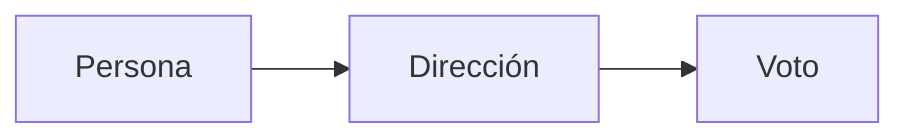

# Investigación: Organizaciones Autónomas Descentralizadas (DAOs) Teoría
<!-- markdownlint-disable MD033 -->
<html><style>*{scroll-behavior:smooth}</style></html>

## Tabla Contenido

- [Investigación: Organizaciones Autónomas Descentralizadas (DAOs) Teoría](#investigación-organizaciones-autónomas-descentralizadas-daos-teoría)
  - [Tabla Contenido](#tabla-contenido)
  - [Introducción](#introducción)
  - [Uso de las DAO](#uso-de-las-dao)
  - [Smart Contracts y DAOs](#smart-contracts-y-daos)
  - [Fundamentos de las DAO en la Blockchain](#fundamentos-de-las-dao-en-la-blockchain)
    - [Programación y ejecución de acciones](#programación-y-ejecución-de-acciones)
    - [Protocolo de consenso](#protocolo-de-consenso)
    - [Protocolo para la participación de votantes](#protocolo-para-la-participación-de-votantes)
      - [Emisión de tokens de gobernanza](#emisión-de-tokens-de-gobernanza)
        - [Desventajas de la emisión de tokens](#desventajas-de-la-emisión-de-tokens)
      - [Skin in the Game](#skin-in-the-game)
      - [Prueba de Participación](#prueba-de-participación)
    - [Grabación de cualquier suceso que ocurra en la DAO](#grabación-de-cualquier-suceso-que-ocurra-en-la-dao)
  - [Ejemplo sencillo de implementación de una DAO](#ejemplo-sencillo-de-implementación-de-una-dao)
  - [Flujo DAO](#flujo-dao)
  - [Categorías de tipos de Votación](#categorías-de-tipos-de-votación)
    - [On-Chain](#on-chain)
    - [Off-Chain](#off-chain)
  - [Referencias](#referencias)

## Introducción

Una Organización Autónoma Descentralizada o DAO es una organización, que apoyándose en la tecnología blockchain, utiliza algoritmos para controlarse y autogestionarse. Estos algoritmos son un conjunto de Smart Contracts donde se definen las reglas con las que regularán cada una de las partes involucradas en la organización.

Estas organizaciones creadas gracias a la tecnología de la cadena de bloques permite organizaciones autónomas, autogestionadas, más transparentes y eficientes.

Una organización o una empresa se basan en una estructura piramidal, existe una jerarquía. En las DAO o DAC (Compañías Autónomas Descentralizadas ) no existe esa distribución tradicional, el conjunto de personas involucradas tienen la misma igualdad y oportunidad de voto sobre cualquier propuesta.

## Uso de las DAO

Este tipo de organizaciones, creados para las tomas de decisiones, son utilizados con fines financieros, inversiones en criptomonedas, NFTs o las famosas finanzas descentralizadas.

## Smart Contracts y DAOs

Los Smart Contract y la blockchain brindan la tecnología perfecta para llevar a cabo la idea surgida ya por Werner Dilger en 1997, su idea planteada era la de un sistema de casa inteligente autónomo y autosostenida. Gracias a la llegada de Ethereum uniendo la cadena de bloques y la ejecución de código sobre dicha tecnología permitió el desarrollo de esta idea.

Gracias a los Smart Contract se pueden definir el conjunto de tareas que deben realizar la DAO y las reglas o mecanismos que permiten el consenso entre las diferentes partes.

## Fundamentos de las DAO en la Blockchain

Existen cuatro funciones básicas (reglas, o mecanismos) sobre las que se rigen las dao:

1. Programar acciones ejecutadas atendiendo a sus parámetros de entrada.
2. Protocolo Consenso.
3. Emisión de Tokens Gobernanza.
4. Grabación de cualquier suceso que ocurra en la DAO.

### Programación y ejecución de acciones

La Organización debe constar de un conjunto de reglas que gobiernen la DAO de manera autónoma, esto se consigue por medio de la programación de uno o varios Smart Contracts.
Un conjunto de acciones básicas sería el registro de nuevas propuestas, registro de nuevos miembros, protocolo de votación, definición de la participación mínima, ...

### Protocolo de consenso

Toda decisión tomada, ya sea de conformidad, que se esté en contra de la propuesta o se abstenga, deben ser consensuadas entre el conjunto de las partes involucradas.

### Protocolo para la participación de votantes

¿Cómo se vota? que poder se le da al usuario de la comunidad para votar. Existen diversas soluciones.

#### Emisión de tokens de gobernanza

Para el control de la economía de la organización y como medida de regulación de las DAO se emite un token de Gobernanza, este token da la posibilidad de participar en las votaciones.

En resumen, proporciona derecho a participar dentro de la DAO, "compras tu voto".

##### Desventajas de la emisión de tokens

Los tokens utilizados son los estándares ERC20 y ERC721, el poder de voto se otorga una vez comprado este conjunto de tokens, gracias a ello se organiza la DAO.

El problema que aparece con esta solución es el poder otorgado a aquellos miembros con mayor poder económico, se está dando mayor "derecho de voto" a aquellos que poseen mayores fondos.

Patrick Collins indica un problema de la emisión de tokens:

> "Si con la compra de un conjunto grande de votos, se toman malas decisiones (para la comunidad) y luego vendes todos los votos, tú como individuo no se te penaliza, solo se castiga al grupo en su conjunto, si eres malicioso puedes salirte con la tuya. Por tanto, este tipo de mecanismo es correcto para ciertos grupos o mecanismos"

[What is a DAO? How to Build a DAO? (High Level) - Patrick COllins - 8:10](https://www.youtube.com/watch?v=X_QKZzd68ro)

#### Skin in the Game

Haciendo mención a un articulo del fundador de Ethereum, Vitalik, este habla de que una vez generado un voto, este será grabado en la red. En el caso de que dicho voto haya supuesto una mala decisión para la comunidad, el poder de voto sería quitado del usuario.

¿Pero cómo se decide que un voto fue malo? ¿Quién lo decide la propia comunidad?
Este tipo de penalización podría ser factible en una DAO donde la toma de decisiones implicara un beneficio económico. Ya que sabiendo que conjunto de personas ha votado en una mala decisión, perdiendo dinero estos podrán ser penalizados.

Si se traslada este mecanismo a una DAO donde no exista este beneficio económico, como es el caso de la plataforma FoolMeOnce, como se valoraría que un voto fue "malo" sobre una promesa electoral.

#### Prueba de Participación

Con este tipo de mecanismo idealmente se tendría que cada persona posee un voto; una persona, una dirección, un voto.



El problema reside en como se verifica que dicha persona no tiene más de una cuenta para votar. ¿Qué pasa con los bots?. El conocido problema como el [ataque Sybil](https://es.wikipedia.org/wiki/Ataque_Sybil)

Una manera de verificar esta prueba de participación es utilizando datos que justifiquen que una dirección de la red es una persona y no se repite, un ejemplo es la verificación que se realiza con los exchange donde se pide documentación oficial y una imagen de la persona permitiendo verificarla. De esta manera estos datos que están fuera de la cadena de bloques se podrían transmitir via Oráculos Descentralizados o cualquier otro tipo de tecnología descentralizada para verificar la participación legítima.

### Grabación de cualquier suceso que ocurra en la DAO

La Blockchain lo ofrece de manera trazable, inmutable y transparente.

## Ejemplo sencillo de implementación de una DAO

Una comunidad de vecinos, sería un ejemplo perfecto para una DAO, cada vecino cada trimestre o tiempo determinado debe pagar una cuota, para pagar agua, seguros, luz, ... con este pago se podría generar un token de gobernanza y regular los pagos, de esta manera el que no pague las cuotas no tiene derecho a voto ni tampoco a proponer. Por otra parte, estaría la parte de las propuestas donde se crea un mecanismo por el cual publicar asuntos a realizar en la comunidad, la DAO se encargaría de registrarlo, verificar los votos e indicar el consenso al que se ha llegado.

## Flujo DAO

A continuación se muestra el orden de acciones generales que una DAO sigue

```flow
st=>start: DAO
pr=>present: Presentación Idea
vot=>vot: Votacion
e=>end: End
opl=>operation: Nueva Propuesta
subl=>subroutine: Rechazar Propuesta
cond=>condition: Votación
io=>inputoutput: Aceptar Propuesta

st->opl->cond
cond(yes)->io->e
cond(no)->subl(right)->OPI
```

## Categorías de tipos de Votación

Se diferencia dos tipos, debido al coste de ejecución de tareas en la red Ethereum.

### On-Chain

Una votación sobre la cadena de bloques sería lo "común", una persona de la comunidad utilizando su wallet emitiría la transacción de voto, con lo que cueste.
Tiene todas las características de inmutabilidad, trazabilidad, seguridad y transparencia.
<!-- TODO: Revisar la siguiente parte -->
Se menciona una solución denominada Governor C, donde se utiliza un muestreo aleatorios para hacer algunas votaciones cuadráticas para ayudar a reducir el costo al tiempo que aumenta la resistencia a un ataque de tipo Sybil.

### Off-Chain

Si se opta por votar no directamente a la blockchain sino a un servicio descentralizado seguro, se podría ahorrar los costes de los votos, de esta manera se plantea enviar transacciones firmadas a una bases de datos descentralizada (IPFS) sin gastar gas en una red blockchain. Posteriormente, con el fin del periodo de votación se contabilizarían los votos de IPFS para que un oráculo los enviara a la blockchain en una única transacción, reduciendo el coste de la votación.

## Referencias

- [Video youtube Patrick Collins](https://www.youtube.com/watch?v=AhJtmUqhAqg)
- [Blog Dao - Patrick Collins](https://betterprogramming.pub/what-is-a-dao-what-is-the-architecture-of-a-dao-how-to-build-a-dao-high-level-d096a97162cc)
- [Video freecodecamp](https://www.youtube.com/watch?v=X_QKZzd68ro)
- [Curso Bit2me DAO](https://academy.bit2me.com/cursos/curso-sobre-organizaciones-autonomas-descentralizadas-dao/lecciones/introduccion-curso-dao/)
- [Ataque Sybil - Wikipedia](https://es.wikipedia.org/wiki/Ataque_Sybil)
- [Built and anonymous voting system](https://thebojda.medium.com/how-i-built-an-anonymous-voting-system-on-the-ethereum-blockchain-using-zero-knowledge-proof-d5ab286228fd)
- W. Dilger, "Decentralized autonomous organization of the intelligent home according to the principle of the immune system," 1997 IEEE International Conference on Systems, Man, and Cybernetics. Computational Cybernetics and Simulation, Orlando, FL, USA, 1997, pp. 351-356 vol.1, doi: 10.1109/ICSMC.1997.625775.
- [https://www.brightid.org/about-us](https://www.brightid.org/about-us)
- [Skin in the Game - Vitalik](https://vitalik.ca/general/2021/08/16/voting3.html)
- [Governor C - video](https://www.youtube.com/watch?v=VWdOQZDfxDE)
- [Github -> Governor-c - github](https://github.com/Team-DAppO/Governor-C)
- [Noticia -> Governor-c devpost](https://devpost.com/software/governor-c-sybil-resistant-quadratic-voting-system)
