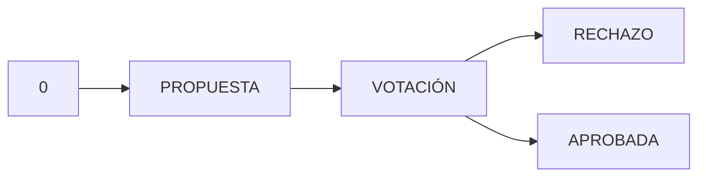
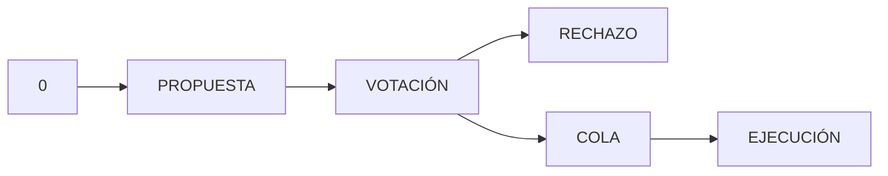

# Investigación Prácticas DAOs --> PRUEBA DE CONCEPTO

- [Investigación Prácticas DAOs --\> PRUEBA DE CONCEPTO](#investigación-prácticas-daos----prueba-de-concepto)
  - [Introducción.](#introducción)
  - [Gobernanza con OpenZeppelin (On Chain)](#gobernanza-con-openzeppelin-on-chain)
    - [Partes de una DAO explicación](#partes-de-una-dao-explicación)
      - [Contrato 1. Governor.sol](#contrato-1-governorsol)
      - [Contrato 2. Voto](#contrato-2-voto)
      - [Contrato 3. Control (TimeLockController)](#contrato-3-control-timelockcontroller)
      - [Contrato 4. Gobierno: Sobre el que se ejecutara los procesos de la DAO](#contrato-4-gobierno-sobre-el-que-se-ejecutara-los-procesos-de-la-dao)
    - [Proyecto DAO Full On-Chain](#proyecto-dao-full-on-chain)
      - [Función a gobernar -\> ApprovePromise(uint256 id)](#función-a-gobernar---approvepromiseuint256-id)
      - [Gobernanza](#gobernanza)
        - [Despliegue de la DAO](#despliegue-de-la-dao)
        - [Ejemplo de Propuesta Votación y Ejecución](#ejemplo-de-propuesta-votación-y-ejecución)
          - [Preparación](#preparación)
          - [Propuestas](#propuestas)
          - [Votación](#votación)
          - [Cola y Ejecución](#cola-y-ejecución)
          - [Cola](#cola)
          - [Ejecución](#ejecución)
  - [Referencias](#referencias)

## Introducción

En este apartado se realizarán varias investigaciones y una implementación funcional de una DAO siguiendo el modulo de gobernanza ofrecido por OpenZeppelin

## Gobernanza con OpenZeppelin (On Chain)

OpenZeppelin ofrece un servicio de librería de contratos, implementaciones de los EIPs y un continuo mantenimiento del código adaptado a las versiones de Solidity. Además ofrecen una herramienta con la que crear tokens, protocoles, DAOs de manera rápida: [openzeppelin Wizzard](https://docs.openzeppelin.com/contracts/4.x/wizard).

En esencia una DAO como es [COMPOUND](https://compound.finance/) necesita cuatro contratos principales:

1. Contrato de Gobernanza
2. Contrato que brinde el poder de voto.
3. Contrato para el control de tiempo y manejo de privilegios.
4. Contrato sobre el que se ejecutarán el conjunto de acciones de gobernanza.

### Partes de una DAO explicación

  Funcionalidad Básica

Una DAO on-chain brinda cuatro funciones para cumplir con su flujo general, en un anterior apartado se desfragmentaba el flujo en el siguiente:



El conjunto de contratos de OpenZepellin lo hace con un paso más:



Por tanto se diferencian cuatro fases:

- Fase 1: Propuesta (Propose)
- Fase 2: Votación (Vote)
- Fase 3: Cola (Queue)
- Fase 4: Ejecución (Execute)

Este conjunto de fases, son funciones genéricas de la DAO, estas se definen en el contrato principal: Governor.sol, el control de acceso, poder de voto se maneja en otros contratos.

#### Contrato 1. Governor.sol

Governor es un conjunto de contratos para la gobernanza en cadena, su núcleo implementa una interfaz IGovernor.sol con las operaciones básicas de una DAO:

- Propuesta, Votación, ejecución, ...
- Configuración de tiempos para la votación

Para operar entre las distintas fases, se marcan tiempos entre estas para dar tiempo a la comunidad para ejercer su derecho a voto. Este manejo de tiempos se cuantifica por medio del número de bloques de media que genera la red blockchain de Ethereum. Por tanto, en el caso de cambiar de red blockchain estos tiempos se debería de reajustar a dicha cadena.

#### Contrato 2. Voto

Para que el conjunto de la comunidad posea votos se utiliza los estándares ERC20 o ERC721, existen derivados especiales como el ERC20Votes. El derivado de ERC20 brinda la posibilidad de establecer puntos de control para contabilizar el número de tokens que poseen los usuarios antes y después de la votación. Este Voto o poder de voto es el contrato que brinda el Token De Gobernanza.

#### Contrato 3. Control (TimeLockController)

En el constructor de TimeLock se definen dos parámetros a tener en cuenta:

1. Conjunto de direcciones que pueden realizar propuestas
2. Conjunto de direcciones que pueden ejecutar las propuestas

Además se posiciona como dueño o owner del contrato sobre el que se va a ejecutar la gobernanza, de esta manera, cuando se requiera, como es en el caso de aprobar una promesa electoral, se marcaría la función encargada de aprobar promesas con un modificador de onlyOwner, estableciendo que solo timeLock pueda ejecutar dicha función y restringiendo que solo mediante la gobernanza se pueda ejecutar la .

#### Contrato 4. Gobierno: Sobre el que se ejecutara los procesos de la DAO

Se necesita el contrato sobre el que la gobernanza tendrá su peso, en este caso ElectoralManager, este contrato una vez desplegado tendrá como owner y administrador el contrato TimeLock como bien se mencionó con anterioridad.

Como el proceso de verificación de las promesas, se marca con el modificador onlyOwner, permite la gobernanza sobre la verificación de las promesas.

El resto de funciones y variables siguen siendo igualmente de accesibles.

### Proyecto DAO Full On-Chain

El prototipo a desarrollado afronta varios problemas ya conocidos y mencionados:

1. Alto coste en gas para cada transacción de votación.
2. Problema de ataque Sybil, desconocimiento del número de cuentas asociado a una persona.

Al igual que en anteriores apartados se utiliza **hardhat** y **ethers.js** para el desarrollo del proyecto, esta vez se utilizará la propia red blockchain de hardhat ya que se necesitará hacer llamadas especiales que ofrece hardhat para jugar con el tiempo y permitir pasar de fase.

El número de bloques es una variable utilizada para medir tiempos. En la red Ethereum se conoce una media de cuanto tiempo tarda en generarse un nuevo bloque. Debido a varios de los parámetros se deberá realizar llamadas que ofrece hardhat para permitir pasar de fase.

#### Función a gobernar -> ApprovePromise(uint256 id)

La función que aprueba las promesas consta de dos requisitos de datos:

1. Verificación identificador de promesa
2. Los cuatro años de la legislatura desde que se realizado la promesa no han pasado.

De esta manera con el primer paso, se valida que la promesa si que existe y  que nop han pasado los 4 años que duraría la legislatura.

Una promesa se cumplirá dentro del periodo de legislatura, si se ha pasado de dicho periodo el contrato retornará un error.

```Solidity

/**
  * @dev approve an electoral promise updating the parameter dateApproved
  * @param promiseId uint that identifies the electoral promise
  */
function approvePromise(uint256 promiseId) external onlyOwner {
    require(
        promiseId < counterElectoralPromises,
        "Error: electoral promise do not exists"
    );
    DataInfo.DataPromise storage promiseToApprove = listElectoralPromises[
        promiseId
    ];
    //check if 4 years of legislature have passed
    uint256 currentSeconds = block.timestamp;
    uint256 difference = currentSeconds - promiseToApprove.created;
    require(
        difference < secondsLegislature,
        "Error: a legislature already gone"
    );

    promiseToApprove.dateApproved = currentSeconds;
    emit ApprovedPromise(promiseId);
}

```

El parámetro de tiempo de los cuatro años se podría también modificar por DAO debido a que no se trata de 4 años puros debido a la existencia de una campaña electoral previa donde los políticos establecen sus propuestas como candidatos.

La verificación final no es más que actualizar el parámetro de dataApproved correspondiente a la promesa electoral.

#### Gobernanza

Para la parte de gobernanza, se implementa el conjunto de OpenZeppelin para el gobierno mediante el conjunto de contratos:

- Token de Gobierno que se le denomina: ElectoralToken
- TimeLock
- GovernorContract

Y también el propio contrato de ElectoralManager

##### Despliegue de la DAO

- **Primero**: se despliega el contrato que funciona como voto, es decir, nuestro **ElectoralToken** que extiende de ERC20Votes.
- **Segundo**: se lanzará el contrato encargado de manejar el acceso a las funciones de propuesta y ejecución de la DAO, también actuará como controlador sobre las funciones marcadas con el modificador onlyOwner del que es propietario -> **TimeLock**
- **Tercero**: Contrato de gobernanza (**GovernorContract**) este contiene las funciones:

    ```mermaid
    graph LR
    Propuesta --> Votación
    Votación --> Rechazada
    Votación --> Cola-Ejecución
    ```

- **Cuarto** (Configuración): En este apartado se establecerán que dirección tendrá permisos de ejecución, propuesta y administración sobre el contrato TimeLock.
  - En cuanto a permisos de ejecución de una propuesta, ya votada y aprobada, se permitirá que cualquier dirección pueda mandar la transacción que ejecute la propuesta.
  - Se da acceso al contrato de gobierno como generador de propuestas, se le asigna dicho rol.
  - Y por último se revoca el permiso de administrador de la cuenta de despliegue.
    - Si se mantiene este permiso se tendrían una dirección central y ya no se podría afirmar que se trata de una Organización Autónoma **Descentralizada**. Además, habría una dirección que sería administrador de este contrato.
- **Quinto**: despliegue de electorManager y trasferencia del administrador a TimeLock, de esta manera la DAO gobernará sobre las funciones que tengan el modificador OnlyOwner.

Un miembro de la comunidad DAO realizará la operación de propuesta, voto y propuesta mediante el contrato de gobierno -> GovernorContract

##### Ejemplo de Propuesta Votación y Ejecución

Una vez finalizado el despliegue se crearán un conjunto de scripts que permitirán ver el proceso que cualquiera podría realizar ya sea mediante scripts o mediante una interfaz web.

###### Preparación

Primero se deberá generar cuentas de usuario en el contrato de electoralManager y una o más promesas electorales que den juego a generar propuestas.

Se necesitará para esta parte la dirección del contrato de ElectoralManager. De esta manera se podrá hacer uso mediante la librería ethers de realizar llamadas. Este proceso será el mismo que en el apartado web.

```TypeScript
  const registerIdTx = await electoralManagerContract
    .connect(addr1)
    .registerUser(_completeName, _namePoliticalParty, _isPoliticalParty);

  const registerEndTx = registerIdTx.wait(1);
  console.log(registerEndTx);

  // DATA PROMISE
  const _tokenUri = "random uri";
  const _isObligatory = false;

  const createElectoralPromise = await electoralManagerContract
    .connect(addr1)
    .createElectoralPromise(_tokenUri, _isObligatory);

```

A continuación haciendo uso del contrato de gobernanza se realizarán las llamadas de propuesta, votación, poner en cola de ejecución y ejecución.

###### Propuestas

Para esta parte se utilizará el contrato de gobernanza,  este contrato hará como puente entre el usuario y el contrato electoralManager. Un primer usuario realizará una llamada de propuesta, más en detalle, le indicará al contrato de gobernanza lo siguiente:

- Función que quiere ejecutar, es decir, sobre qué función se generará la propuesta
- Datos necesarios para la ejecución si se aprobara en un futuro la promesa

El usuario deberá conocer que función y que datos proponer, para este caso se querrá llamar a la función --> approvePromise y se le pasará el identificador numérico de la promesa.

```TypeScript
  const proposeTxResponse = await governorContract.propose(
    [electoralManagerAddress], // dirección contrato
    [0],
    [encodeFunctionParameter], // función  a llamar con el identificador
    DESCRIPCION_PROPUESTA
  );
    
  // con la ejecución de la llamada se obtiene el identificador de propuesta
  const proposalId = proposeReceipt.events[0].args.proposalId;

```

###### Votación

Para realizar la votación se necesitará conocer el identificador de la propuesta y hacer la llamada al igual que pasaba en el estado de proposición pero en este caso para votar.

Para indicar el tipo de votación: a favor , en contra o abstención se utilizan valores del cero al dos respectivamente.

En conjunto al final se realizará una llamada a la función de votación con dos argumentos:

- identificador de la propuesta
- tipo de voto

```TypeScript
const voteTxResponse = await governorContract.castVoteWithReason(
    proposalId,
    FOR, // A FAVOR (1)
    "reasonVote"
  );

```

Opcionalmente, existen otro tipo de llamadas que permiten votar donde no hace falta incluir la razón de voto y también existe otra donde se envía el voto con la firma.

Una vez finalizada la votación y pasado el tiempo marcado, se puede preguntar en que estado se encuentra la propuesta mediante la siguiente llamada:

```JavaScript
 const stateProposal = await governorContract.state(proposalId);
 // stateProposal = 4 -> Succeded
```

Ese cuatro indica el estado de succeded, yendo al código del contrato de gobierno, a su interfaz [IGobernor.sol](https://github.com/OpenZeppelin/openzeppelin-contracts/blob/v4.8.2/contracts/governance/IGovernor.sol) se encuentra una estructura ENUM denominada ProposalState, el número cuatro corresponde al quinto valor de ese enum.

```Solidity
enum ProposalState {
        Pending,    //0
        Active,     //1
        Canceled,   //2
        Defeated,   //3
        Succeeded,  //4
        Queued,     //5
        Expired,    //6
        Executed    //7
    }
```

###### Cola y Ejecución

En esta última parte se procede a realizar el cambio de estado para permitir finalmente ejecutarla, se realizan dos procesos:

1. Se pone en cola de ejecución
2. Se ejecuta

###### Cola

Para pasar a cola (cualquiera puede realizar esta acción) se necesita indicar al contrato de gobierno que función y que argumentos se van a verificar de nuevo. Esto permite pasar a ejecución la propuesta.

```TypeScript
  const queueTxResponse = await governorContract.queue(
    [electoralManagerAddress],
    [0],
    [encodeFunctionParameter],
    descriptionHash
  );
```

###### Ejecución

Exactamente igual que para la cola, pero esto finalmente ejecutará la función de verificación, una vez completado este proceso se podrá ver la fecha de verificación como parámetro de la promesa electoral, se encuentra marcado como dateApproved.

```TypeScript
  const executeTxResponse = await governorContract.execute(
    [electoralManagerAddress],
    [0],
    [encodeFunctionParameter],
    descriptionHash
  );
```

## Referencias

- [Governance compound](https://compound.finance/)
- [openzeppelin Wizzard](https://docs.openzeppelin.com/contracts/4.x/wizard)
