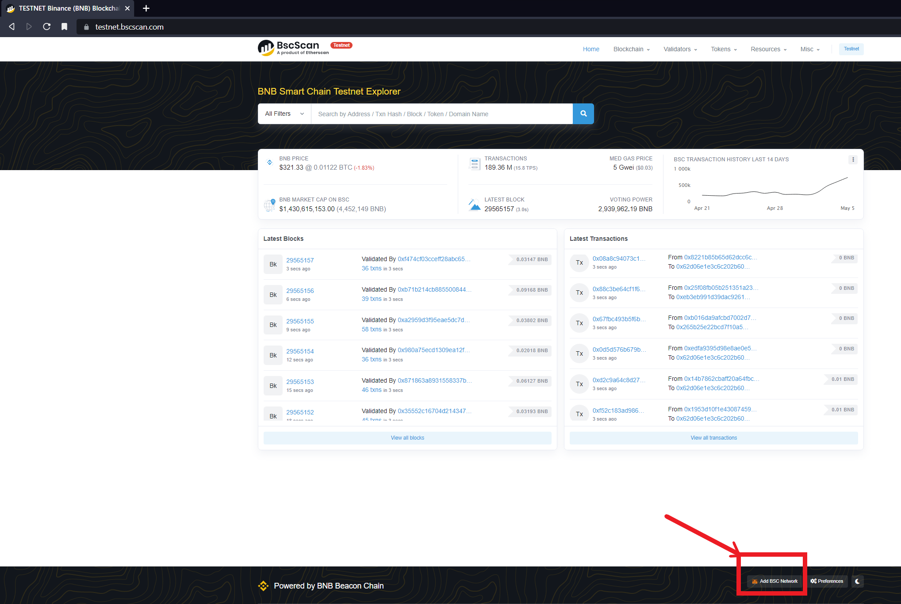

# Conexión a la Red BlockChain

- [Conexión a la Red BlockChain](#conexión-a-la-red-blockchain)
  - [Introducción](#introducción)
  - [Librerías](#librerías)
  - [Arquitectura de la aplicación](#arquitectura-de-la-aplicación)
  - [WEB3.JS y ETHERS.JS](#web3js-y-ethersjs)
    - [Diferencias fundamentales](#diferencias-fundamentales)
  - [Otras herramientas para el desarrollo](#otras-herramientas-para-el-desarrollo)
    - [Hardhat Y Truffle](#hardhat-y-truffle)
    - [Diferencias entre Hardhat y Truffle](#diferencias-entre-hardhat-y-truffle)
    - [Despliegue en redes de Prueba](#despliegue-en-redes-de-prueba)
  - [Referencias](#referencias)

## Introducción

Los Smart Contracts una vez compilados disponen de un archivo ABI (Application binary Interface) donde en un formato de JSON (JavaScript Object Notation) muestra el conjunto de funciones que posee el contrato.

Para la comunicación con los contratos en las aplicaciones descentralizadas, los usuarios deben conectarse a la red Ethereum, es decir, debe haber una comunicación con la Ethereum Virtual machine y el usuarios, para ello las comunicaciones son establecidas por el protocolo [JSON-RPC](https://ethereum.org/es/developers/docs/apis/json-rpc/).

## Librerías

Existen librerías como Web3.js o ethers.js que simplifican estas llamadas y ayudan a los desarrolladores en este ámbito de la comunicación entre usuarios y Ethereum.

No existen solo librerías para JavaScript sino que existen a día de hoy librerías para conectar aplicaciones a la red de Ethereum para otros lenguajes como:

- Java: existe el modulo [web3](https://github.com/web3j/web3j)
- Python: existe [web3.py](https://github.com/ethereum/web3.py)

## Arquitectura de la aplicación

Para la aplicación construida, dividida en dos capas:

- Back: descentralizada mediante contratos escritos en Solidity
- Front: uso de la librería React para la creación de la interfaz de usuario

Pero también se necesita de una librería que permita realizar llamadas a los contratos via JSON-RPC de manera sencilla, y es aquí donde entran las librerías web3.js y ethers.js.

Se analizan sendas librerías debido a su importancia en la plataforma y se discute que ventajas tiene cada una.

## WEB3.JS y ETHERS.JS

Estas dos librerías ofrecen un conjunto de herramientas para interactuar con los contratos y también con la propia red de ethereum, de esta manera se le ofrece al desarrollador una manera sencilla de cargar los contratos, llamarlos, etc

web3.js fue la primera de las librerías en nacer a manos de la propia fundación de Ethereum mientras que ether.js fue lanzado más recientemente y se trata de una librería más [ligera](https://blog.openreplay.com/comparing-blockchain-libraries--web3js-vs-ethersjs/) que web3.js


### Diferencias fundamentales

Web3js implementa un objeto único denominado Web3 donde crea todas las llamadas necesarias para interactuar con la red blockchain, mientras que ethers se divide en dos partes:

1. Se encarga de conectarse a la red blockchain de ethereum (provider)
2. Se encarga de manejar la cuenta del usuario, wallet, clave privada (signer)

Por otra parte, otra de las diferencias importantes es la libertad del código, la licencia que tiene web3.js es más restrictiva que ethers.js, esta última es MIT.

Otras diferencias en cuanto a como funciona cada una de las librerías:

```JavaScript

Instantiating contract
web3

const electoralManager = new web3.eth.Contract(electoralManagerABI, electoralManagerAddress);

ethers

const myContract = new ethers.Contract(electoralManagerAddress, electoralManagerABI, provider.getSigner());

# Provider se obtendría:
const provider = new ethers.providers.Web3Provider(window.ethereum);
    const signer = provider.getSigner();

Calling contract method
web3

const balance = await electoralManager.methods.getAllPromises().call()

ethers

const balance = await electoralManager.getAllPromises()
```

Por [https://medium.com/coinmonks/the-distinctions-between-ethers-js-and-web3-js-8e51f60083ce](https://medium.com/coinmonks/the-distinctions-between-ethers-js-and-web3-js-8e51f60083ce)

Un punto notable a favor de la librería ethers.js se trata de que permite la conexión con algunas de las redes blockchain que tengan como base la máquina virtual de ethereum (EVM) como son Polygon y Avalanche, esto permite a los desarrolladores una ventaja bastante grande cunado desean probar sus Smart Contracts en entornos escalables para sus aplicaciones descentralizadas
según [https://101blockchains.com/ethers-js-tutorial/](https://101blockchains.com/ethers-js-tutorial/).

Otro punto importante es la integración que tiene ethers con otros entornos para el desarrollo, un ejemplo claro es hardhat, hardhat es una herramienta que brinda una manera sencilla de probar, compilar y desplegar aplicaciones sobre redes blockchain.

Además, ethers permite escribir código en TypeScript ya desde sus inicios, además de tener un conjunto mayor de test realizadas sobres su propio código [https://docs.alchemy.com/docs/ethersjs-vs-web3js-sdk-comparison](https://docs.alchemy.com/docs/ethersjs-vs-web3js-sdk-comparison), y también da soporte al dominio de nombres de ethereum, al ENS.

Todos estos puntos a favor y la simplicidad de las funciones sobre los contratos son lo que hacen de esta librería y la herramienta Hardhat mi elección para el proyecto.

## Otras herramientas para el desarrollo

Se ha mencionado tanto Truffle y Hardhat como útil para la compilación, test y despliegue de contratos en una red blockchain.

### Hardhat Y Truffle

Ambas herramientas son muy parecidas comparten características ya mencionados anteriormente ya que disponen de un archivo de configuración que permite realizar establecer parámetros como:

- Version solidity
- redes de blockchain para despliegue
  - Permiten configurar diferentes entornos ya sean:
    - Local
    - testnet
    - Mainnet
- Para el despliegue en redes principales y de pruebas, permite a través de mnemonic (código de palabras de las wallet) obtener la moneda para realizar el despliegue.

### Diferencias entre Hardhat y Truffle

Una característica que diferencia a [truffle es su base de datos](https://trufflesuite.com/docs/truffle/db/), la herramienta, a medida que avanza el desarrollo de los contratos, realiza un proceso de salvaguarda de datos, histórico  y organización.

¿Qué destaca Hardhat? Esta herramienta posee una características que ayudan más al desarrollador, posee una configuración mayor, desde el mapa de cobertura de los test de los contratos hasta el incluir la biblioteca ethers para el desarrollo, pero sobre todo, la mejor parte es que posee una blockchain interna que permite pruebas locales, mientras que para hacer uso de una red local en truffle se deberá de instalar una red simulada como Ganache.

Ganache es una herramienta de simulación de la red blockchain de Ethereum, existen dos versiones, una con interfaz de usuario y otra de CLI, la primera brinda una interfaz donde cómodamente permite ver el número de bloques generados, interactuar con las cuentas existentes, también permite importar los contratos a ganache mediante truffle, pero ambas herramientas tanto Truffle como Hardhat permiten establecer Ganache como entorno de pruebas.

La configuración de despliegue es bien sencilla, solo se necesita conocer su direccion ip y su network id. Un ejemplo de configuración en hardhat para desplegar contratos en ganache sería:

```JavaScript
require("@nomicfoundation/hardhat-toolbox");

/** @type import('hardhat/config').HardhatUserConfig */
module.exports = {
  solidity: "0.8.17", // version solidity compiler

  paths: { // paths for contracts files
    artifacts: "./artifacts",
    sources: "./contracts",
    cache: "./cache",
    tests: "./test"
  },

  networks: {
    ganache: { // network deploy ganache
      url: "http://127.0.0.1:7545"
    }
  }

};

```


### Despliegue en redes de Prueba

Si se quisiera desplegar en una testnet, por ejemplo, la de Binance se deberían realizar tres acciones, contando que ya se posee una extensión con una wallet de Metamask:

1. Agregar la red de test de Binance a la Wallet
   1. Se debe acudir a la página web de test oficial: <https://testnet.bscscan.com/>
   2. Se encontrará con un botón de agregar dicha red a la wallet que posee el usuario.
   3. 

2. Se solicitarán criptomonedas (es gratuito) para desplegar en la red, de esta manera, se tendrá una cuenta en la red de Binance Testnet con una cantidad que permita el despliegue de los contratos.
   1. Para obtener dicha moneda se podrá buscar en el navegador "Faucet Binance Test", el enlace correcto sería: <https://testnet.binance.org/faucet-smart/>
   2. Se pedirá que se indique la dirección donde se quieren los fondos y en un corto espacio de tiempo aparecerán dichos fondos en la Wallet indicada.

3. Configurar hardhat para el despliegue:
   1. Se necesitará conocer la clave secreta de la cuenta, esto se puede ver mediante el posicionamiento en la cuenta requerida y pinchando en los 3 puntos para ir a "Detalles de la cuenta", luego a exportar cuenta y exportar clave privada. Se requerirá la clave de metamask
   2. Para evitar el control de versiones dicha clave se guardara en un archivo denominado .secret para agregarlo a .gitignore. Esta parte es fundamental por seguridad
   3. La configuración final sería en el fichero de configuración:

```JavaScript
require("@nomiclabs/hardhat-waffle");
const fs = require('fs');
const privateKey = fs.readFileSync(".secret").toString().trim();

module.exports = {
  solidity: "0.8.17",

  networks: {
    ganache: {
      url: "http://127.0.0.1:7545"
    },
    binanceTestnet: {
      url: 'https://data-seed-prebsc-1-s1.binance.org:8545',
      accounts: [privateKey]
    },
    hardhat: {
    },

  },
};
```

Otro ejemplo pero para desplegar en la red oficial de Binance sería [este](https://docs.bnbchain.org/docs/hardhat-new/), ofrecido por la pagina oficial de Hardhat

## Referencias

- [hardhat](https://hardhat.org/)
- [truffle](https://trufflesuite.com/)
- [hardhat-vs-truffle](https://101blockchains.com/hardhat-vs-truffle/)
- [Hardhat deploy binance](https://docs.bnbchain.org/docs/hardhat-new/)
