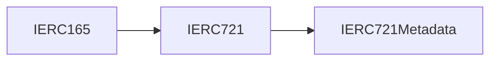
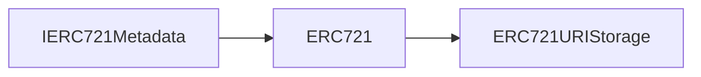

# Introducción
<!-- markdownlint-disable MD033 -->
<html><style>*{scroll-behavior:smooth}</style></html>
A partir de los ERCs mencionados en el [Estudio de los estándares conocidos como ERC](https://gitlab.com/HP-SCDS/Observatorio/2022-2023/foolmeonce/epi-foolmeonce/-/issues/3), se propone un análisis de los estándares, en cuanto a código, de esta manera y aprendiendo los fundamentos del lenguaje Solidity, podremos ver de manera más sencilla como adaptar estos estándares al proyecto y aprender a programar en la Blockchain.

## Tabla de Contenido

- [Introducción](#introducción)
  - [Tabla de Contenido](#tabla-de-contenido)
  - [Smart Contracts en Solidity](#smart-contracts-en-solidity)
  - [Implementación de los estándares](#implementación-de-los-estándares)
    - [ERC-165](#erc-165)
      - [Ejecución de ejemplo](#ejecución-de-ejemplo)
      - [¿Qué hace la función type()?](#qué-hace-la-función-type)
  - [Eventos en Solidity](#eventos-en-solidity)
  - [ERC721](#erc721)
    - [Estándar IERC721Metadata e implementación en ERC721URIStorage](#estándar-ierc721metadata-e-implementación-en-erc721uristorage)
  - [Implementación de Promesas Electorales](#implementación-de-promesas-electorales)
    - [Procedimiento en Remix](#procedimiento-en-remix)
  - [Referencias](#referencias)

## Smart Contracts en Solidity

Ciertos [protocolos de la Blockchain](https://gitlab.com/HP-SCDS/Observatorio/2022-2023/foolmeonce/epi-foolmeonce/-/issues/1) permiten ejecutar código que no fuera propio de la red dentro de los nodos, estos contratos inteligentes (Smart Contrats) no dejan de ser más que un programa escrito en un lenguaje (Solidity) que se compila y es ejecutado en la EVM, siendo todo ello guardado en la ledger, en el gran libro de cuentas de Ethereum (o cualquier otro protocolo que implemente la tecnología BlockChain).

Para este proyecto utilizaremos Remix IDE (ya mencionado) este IDE nos permite ya sea por su web o instalando como aplicación de escritorio: compilar, debuguear, comprobar la seguridad de los contratos, testear nuestro código, pero lo más importante es que nos ofrece una manera muy sencilla de desplegar y comprobar las transacciones que genera nuestros contratos. También nos proporciona un conjunto de direcciones con las que podemos probar el código. Existe un plugin sencillo para Visual Studio Code

## Implementación de los estándares

En esta parte, se verá una implementación de los estándares 721 y 1155, los cuales nos permitirán implementar tokens no gastables o tokens no fungibles (NFTs), se implementará siguiendo la documentación oficial y utilizando el ERC-165.

### ERC-165

Este estándar permite establece una manera de identificar las interfaces que implementa un smart contract:

```Solidity
/// @title Interface EIP-165
interface IERC165 {
    /**
     * @dev returns true it this contract implements the interface defined by `interfaceId'
     * @param {interfaceId} Identifier of the interface
     */
    function supportsInterface(bytes4 interfaceId) external view returns (bool);
}
```

Con la llamada a la función se le puede preguntar a un contrato si implementa una interfaz, en la llamada se le pasa un resumen de los 4 primeros bytes de la interfaz. Un ejemplo sería:

```Solidity
// SPDX-License-Identifier: MIT
pragma solidity 0.8.18;

import "@openzeppelin/contracts/utils/introspection/IERC165.sol";

///@title Interfaz say hello
interface OtraInterfaz {
    function sayHello() external pure returns (string memory);
}

///@title Pruebas
contract PruebaIERC165 is IERC165, OtraInterfaz {


    bytes4 public interfaceOtra = type(OtraInterfaz).interfaceId;
    bytes4 public interfaceIERC165 = type(IERC165).interfaceId;

    function sayHello() external pure returns (string memory) {
        return "Hi";
    }

    function supportsInterface(bytes4 interfaceId)
        external
        view
        override
        returns (bool)
    {
        return
            type(IERC165).interfaceId == interfaceId ||
            interfaceOtra == interfaceId;
    }
}
```

#### Ejecución de ejemplo

Si desplegamos el contrato utilizando Remix IDE y ejecutamos todas las funciones:


Podemos ver cuales son los valores de la interfaz IERC165: bytes4: 0x01ffc9a7, también de la interfaz "OtraInterfaz": bytes4: 0xef5fb05b, si pasamos un valor a la función supportsInterface con uno que no coincida con los dos anteriores esta funciona devuelve un booleano false.

#### ¿Qué hace la función type()?

La función type recoge de la interfaz todos los identificadores de las funciones y realiza una operación XOR de estos, resultando en un código en hexadecimal guardado en una variable de tipo bytes4.

## Eventos en Solidity

Inciso, en Ethereum existen los denominados eventos como una forma de notificación y que también se utiliza como historial de sucesos de un smart contract. Estos eventos tienen un nombre y uno valores, que pueden ser direcciones, cantidades, etc. Una característica importante de este evento es que los valores se pueden indexar para ayudar en la búsqueda de datos, se podría declarar un evento como:

_event NuevoNFT(address indexed userAddress, uint256 id):_
Para emitir este evento en un Smart Contract, sencillamente se utiliza la palabra reservada 'emit' junto al nombre del evento y el conjunto de datos que requiere el evento.

## ERC721

El estándar ERC721 define varias interfaces junto con sus implementaciones





### Estándar IERC721Metadata e implementación en ERC721URIStorage

Estas interfaces hacen mención al estándar [RFC 3986](https://www.ietf.org/rfc/rfc3986.txt), el cual especifica la definición de URI, debido a que como se menciona en EIP721 se pretende guardar activos digitales junto a sus distintas propiedades, esta URI es una referencia a una plataforma de ficheros distribuida, la cual devolverá un fichero JSON con los metadatos del NFT (propiedades del activo), el propio estándar ya permite definir nombre y descripción de un NFT.

Por tanto, para hacerlo más global y en un primer acercamiento a la construcción de un contrato que almacene NFTs se puede implementar .

## Implementación de Promesas Electorales

Una vez implementada la base del estándar ERC721 solo queda realizar un programa básico que permita la creación de promesas electorales:

```Solidity
// SPDX-License-Identifier: MIT
pragma solidity 0.8.18;


import "ERCs/ERC721/ERC721.sol";


/// @author Miguel Rodriguez Gonzalez
contract PromesaElectoral721 is ERC721 {

    /// constructor
    constructor(string memory _name, string memory _symbol)
        ERC721("FoolMeOnce", "FMO")
    {}

    /// Contador ids ERC721
    uint256 COUNTER;

    // Struct for the Promise
    struct Promise {
        string title;
        string description;
        uint256 id;
        string name;
        address onwer;
    }

    Promise[] public electoralPromises;

    /// new promise
    function createElectoralPromise(
        string memory _title,
        string memory _description,
        string memory _name
        ) public {
            Promise memory newPromise = Promise(_title, _description, COUNTER,_name, msg.sender);
            electoralPromises.push(newPromise);
            _safeMint(msg.sender, COUNTER);
            COUNTER++;
        }

}
```

Haciendo uso de un Struct, permite definir nuevos tipos de datos al igual que permite crear un array donde poder almacenar el nuevo tipo de dato. Gracias a esto, podemos crear una función que se encargue de crear la promesa.
La función recibirá los principales datos por parámetro, creando un nuevo dato y generando un nuevo NFT con la llamada a \_safeMint.

### Procedimiento en Remix

Para desplegar este contrato de prueba haré uso de Remix ya que de manera sencilla permitirá desplegar sobre contrato sobre una red de test (o tesnet) junto a cuentas con ethers para la prueba.


Para el despliegue solo se necesita movernos a la parte de "Deploy & Run Transactions", justo tendremos un botón que nos permitirá hacer el Deploy (color naranja).

Una vez realizado el despliegue podemos comprobar llamando a la función name, la cual debería devolver: "FoolMeOnce". Ejecutando la llamada obtenemos la siguiente info de la transacción:

```Json

from: 0x5B38Da6a701c568545dCfcB03FcB875f56beddC4to: PromesaElectoral721.name()data: 0x06f...dde03
from 0x5B38Da6a701c568545dCfcB03FcB875f56beddC4
to PromesaElectoral721.name() 0xd8b934580fcE35a11B58C6D73aDeE468a2833fa8
execution cost 3477 gas (Cost only applies when called by a contract)
input 0x06f...dde03
decoded input {}
decoded output {
 "0": "string: FoolMeOnce"
}
logs []
```

Como se ve devuelve FoolMeOnce, parámetro que se fija en el constructor. Lo mimo pasa con el símbolo.
Para crear una promesa se hará uso de la función 'createElectoralPromise':


rellenando los datos y ejecutando el botón se creará el objeto de la promesa.

Si uno presta especial atención a estas dos funciones que se ejecutan, se distinguen dos colores, el azul y el naranja, Remix colorea de las llamadas a funciones desde el azul, llamada o consultas de datos públicas o funciones de tipo view, al rojo, las funciones coloreadas de rojo son las payable, las que esperan recibir ether en la transacción, es decir, con la ejecución de la función se espera que en el campo de valor (msg.value) lleve ether. El otro color intermedio es el naranja, son funciones que modifican el estado del contrato pero no conllevan un pago como las rojas sino que su valor es el coste en gas de la ejecución de la transacción.

Si comprobamos el balance de la cuenta con la que se ejecuta la creación de la promesa se muestra que tenemos un token en esa cuenta si se accede al vector creado, a su posición cero, podremos ver el resultado del minteo de la promesa electoral.


## Referencias

- [Eventos](https://medium.com/@shuffledex/eventos-en-la-blockchain-c%C3%B3mo-emitirlos-con-solidity-y-recepcionarlos-con-web3-js-6411dafee8b7S)
- [función type - documentación solidity](https://docs.soliditylang.org/en/v0.8.18/units-and-global-variables.html#type-information)
- [Where to store the metadata of a NFTs - OpenZepellin](https://forum.openzeppelin.com/t/where-to-store-nft-metadata-and-where-to-set-the-price/6322)
- [Justificación del estándar ERC721](https://eips.ethereum.org/EIPS/eip-721#rationale)
