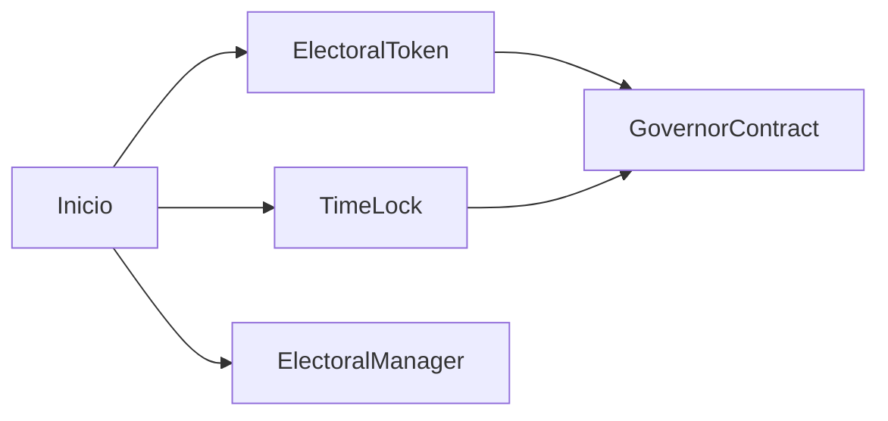
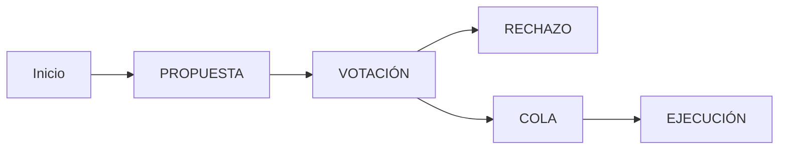

# Deploy DAO on Ganache and Vote for One of them

- [Deploy DAO on Ganache and Vote for One of them](#deploy-dao-on-ganache-and-vote-for-one-of-them)
  - [Introducción](#introducción)
  - [Levantar BlockChain Ganache CLI](#levantar-blockchain-ganache-cli)
  - [Despliegue dao](#despliegue-dao)
  - [Proceso Dao](#proceso-dao)

## Introducción

## Levantar BlockChain Ganache CLI

`yarn ganache`

## Despliegue dao

`yarn hardhat run .\deploy\Ganache\deployDao.ts --network ganacheCli`

1. Despliegue **ElectoralToken**
2. Despliegue **TimeLock**
3. Despliegue **GovernorContract** y configuración
4. Despliegue **ElectoralManager**
5.Crear Datos en **ElectoralManager**
   1. Registrar Politico
   2. Crear dos promesas de ejemplo

## Proceso Dao

1. **Proponer** la verificación de la promesa con identificador cero
2. Adelantar el tiempo para pasar de fase
3. **Votar** sobre la propuesta creada
4. Adelantar el tiempo para pasar de fase
5. **Poner en Cola** para pasa de fase
6. **Ejecutar la verificación** de la promesa

`yarn hardhat run .\deploy\Ganache\exampleVote.ts --network ganacheCli`
